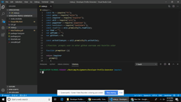

Team Roster - Template Engine

```
As a manager
I want to generate a webpage that displays my team's basic info
so that I have quick access to emails and GitHub profiles
```
* The app will run as a Node CLI to gather information about each employee.

* It uses [Inquire npm package] to prompt the user for their email, id, and specific information based on their role with the company. For instance, an intern may provide their school, whereas an engineer may provide their GitHub username.
 

* Below is an example of what the application may look like. 


* The app has used Manager, Engineer, Intern subclasses which extend to the super class Employee to create instance of the class based on employee's role
```

* The app reads below employeee template specific to the roleand  replaces its values with values of new employee instance which are created using Handlebars template engine.

  * `main.html`

  * `engineer.html`
  
  * `intern.html`
  
  * `manager.html`

The updated cards are then rendenred into output.html file


